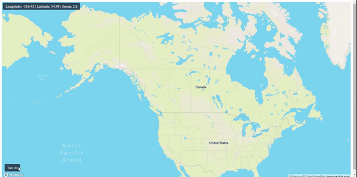

# Weather Radar for the USA
This ReactJs package helps you to show weather radar on a mapbox map. This package fetches data using free APIs of NOAA for the USA only. The package provides nice animation for weather radar data. You can turn on and off the animation as well as the Layer of weather radar.

## Installation
You can install node-shortenurl and its dependencies with npm: `npm install weather-radar-usa`

## Usage

#### Import
`import Weather from 'weather-radar-usa';`

#### Turn on Radar Layer
In component use ref to call weatherRadar methods.
```
const weatherRef = useRef(null);

<Weather 
    ref={weatherRef}
    options= {{
        opacity: 0.8
    }}
    getTime={(time) => setDisplayTime(time)}
/>
```

```
weatherRef.current.trunOnRadar(true, map.current);
```

#### Turn off Radar Layer
```
weatherRef.current.trunOnRadar(false, map.current);
```

#### Turn on Radar Animation
```
weatherRef.current.weatherAnimation(true, map.current)
```

#### Turn off Radar Animation
```
weatherRef.current.weatherAnimation(false, map.current)
```

#### Get the Current Time When Animation is On
Pass the getTime prop to the component.
```
getTime={(time) => {
    // Write your logic here.
}}
```

### Some options that you can pass to the component
```
options= {{
    opacity: 0.8 // Radar Layer opacity min:0, max:1
}}
```

#### Full example is provided into example directory


